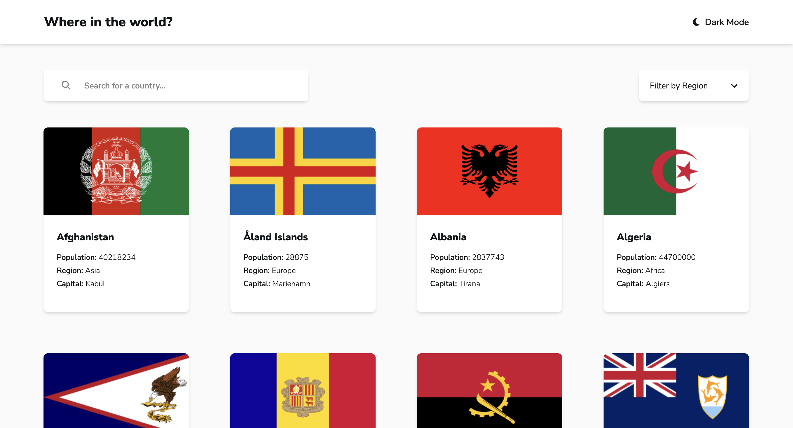
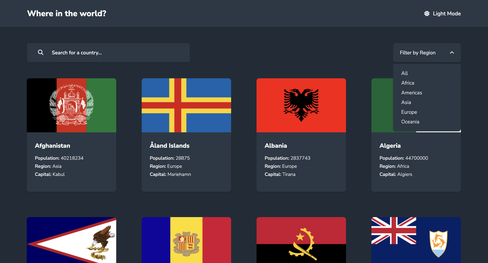
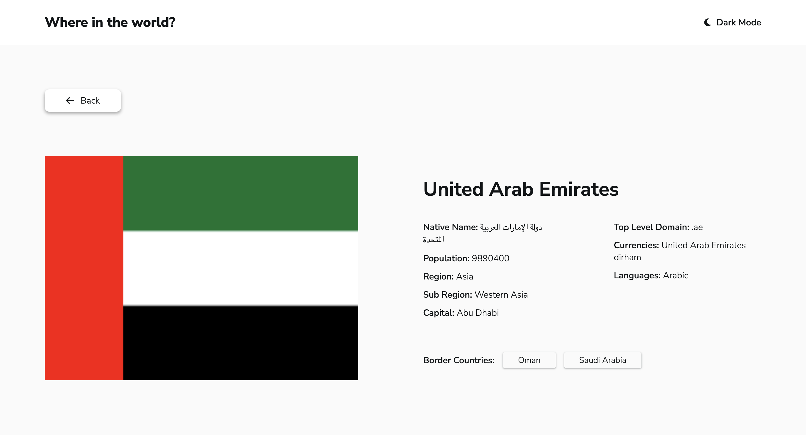

# Countries

This project is a dynamic web application designed to provide users with information about countries worldwide. Built using modern web technologies including HTML5, CSS3, and JavaScript (ES6+), the application offers an intuitive user interface that supports features such as searching for countries, filtering by region, and displaying detailed information about each country.

## Table of contents

- [Overview](#overview)
  - [The challenge](#the-challenge)
  - [Screenshot](#screenshot)
  - [Links](#links)
- [My process](#my-process)
  - [Built with](#built-with)
  - [Continued development](#continued-development)
  - [Useful resources](#useful-resources)
- [Author](#author)

## Overview

### The challenge

Users should be able to:

- See all countries from the API on the homepage
- Search for a country using an `input` field
- Filter countries by region
- Click on a country to see more detailed information on a separate page
- Click through to the border countries on the detail page
- Toggle the color scheme between light and dark mode

### Screenshot

### Links

- [GitHub Repo](https://github.com/Aymmaann/Countries/tree/main)
- [Live Site](https://countries-fe.netlify.app)

## My process

### Built with

- Semantic HTML5 markup
- CSS custom properties
- Flexbox
- ES6 JavaScript

### Continued development

Accessibility remains a priority in the project's development. Recent updates focused on improving screen reader compatibility, and ensuring compliance with web accessibility standards (WCAG). These efforts aim to make the application accessible to users with disabilities, promoting inclusivity and usability for all.

To enhance the application's performance, several optimizations were implemented. This includes efficient data fetching and rendering techniques, minimizing unnecessary reflows and repaints, and optimizing JavaScript functions to handle data manipulation and UI updates more effectively.

### Useful resources

- [MDN Web Docs](https://developer.mozilla.org/) - Comprehensive web development documentation
- [Frontend Mentor](https://www.frontendmentor.io/challenges) - Platform for practicing frontend coding challenges
- [CSS Tricks](https://css-tricks.com/) - Helpful tips and tricks for CSS styling and layout

## Author

- Website - [My portfolio](https://ayman03-portfolio.netlify.app/)
- Frontend Mentor - [@Aymmaann](https://www.frontendmentor.io/profile/Aymmaann)
## Acknowledgements

 - [Awesome Readme Templates](https://awesomeopensource.com/project/elangosundar/awesome-README-templates)
 - [Awesome README](https://github.com/matiassingers/awesome-readme)
 - [How to write a Good readme](https://bulldogjob.com/news/449-how-to-write-a-good-readme-for-your-github-project)

